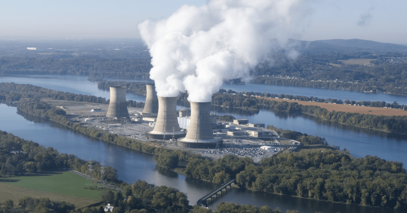
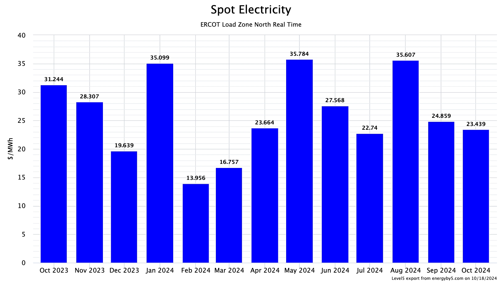
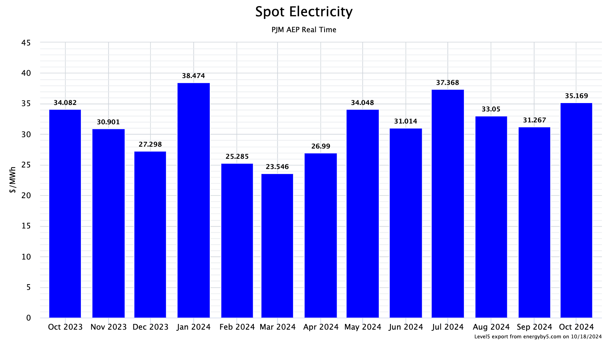
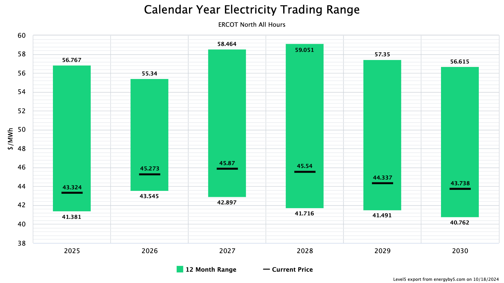
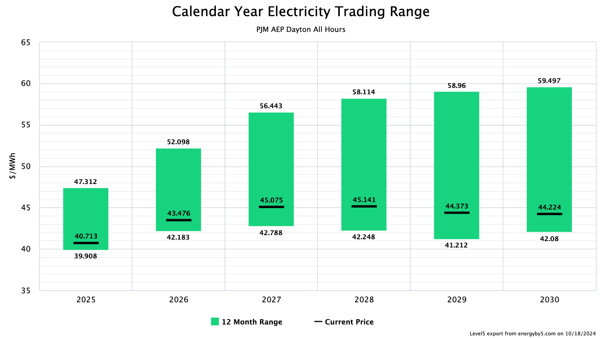
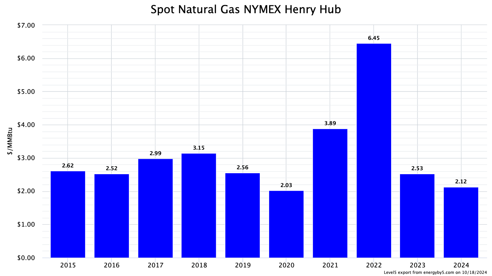

# ENERGY MARKET & DIGITAL ASSET BRIEF
[Zac Coventry](https://www.linkedin.com/in/zaccoventry/) & [5's Z-Team](https://www.energyby5.com/people/eric-bratcher) and [Level5](https://www.energyby5.com/level5)  
October 18, 2024  

| SECTION | CONTENT |  
| - | - |  
| [**HEADLINE**](#headlines) | [The Future of Bitcoin with Michael Saylor](#the-future-of-bitcoin-with-michael-saylor)   [Big Tech Goes Nuclear](#big-tech-goes-nuclear)   |    
| [**MARKETS**](#energy-markets) | [Power](#power-markets)   [Natural Gas](#natural-gas-markets) |    
| [**WEATHER**](#weather)  |   |      

 

## HEADLINES
### THE FUTURE OF BITCOIN WITH MICHAEL SAYLOR

  
**Figure 1**. (photo credit: [YouTube](https://youtu.be/cifuTy4fBfg?feature=shared&t=1500))  

At the 2024 Abundance360 Summit, [**Michael Saylor spoke about the future of Bitcoin**](https://youtu.be/cifuTy4fBfg?feature=shared&t=1500). If you only have a few minutes, start at the 25 minute mark. This talk is also available on [Spotify](https://open.spotify.com/episode/5VHr8vQMEecZr1y7WInJw0?si=fd2425ff276e44bc&nd=1&dlsi=6606ea14319b4950).  
 

### BIG TECH GOES NUCLEAR
  
**Figure 2**. (photo credit: [U.S. Department of Energy](https://www.energy.gov/ne/articles/5-facts-know-about-three-mile-island))  

Google, Amazon, and Microsoft are all pursuing nuclear options to power their data centers.
* [Google Goes Nuclear in Search for New Energy Sources (5 min; Source: Bloomberg Technology)](https://www.youtube.com/watch?v=wSGVsVVEyZ8)  
* [Big Tech has cozied up to nuclear energy (3 min; Source: The Verge)](https://www.theverge.com/2024/10/5/24261405/google-microsoft-amazon-tech-data-center-nuclear-energy)  

  

## ENERGY MARKETS  
**U.S. energy market prices are a bargain right now, though beginning to show bullish sentiments.** I do not expect these buying opportunities to persist in the medium term. 

### POWER MARKETS  
ERCOT and PJM average monthly wholesale power prices are clearing around $25/MWh (Figure 3) and $35/MWh (Figure 4), respectively. These prices fall in the lower half of a twelve-month historical range (Figures 5 and 6).  

    

**Figure 3**. _ERCOT North monthly average spot prices, October 2023 - October 2024_  
   

     

**Figure 4**. _PJM AEP Dayton monthly average spot prices, October 2023 - October 2024_  
   

     

**Figure 5**. _ERCOT North annual futures compared to a 12-month range_  
   

    

**Figure 6**. _PJM AEP Dayton annual futures compared to a 12-month range_  
   
 

### NATURAL GAS MARKETS  
Annualized natural gas prices remain at near-historic lows (Figure 7), however spot prices have risen by about $0.03/MMBtu over the last week. I am still bullish in the medium-term due to increasing demand for grid power (e.g., data center loads), increasing LNG export capabilities, and U.S. natural storage values falling closer to the five-year historical average (Figure 8).

   

**Figure 7**. _Annualized wholesale natural gas, NYMEX Henry Hub, 2015-2024_  
   

    

**Figure 8**.
    

### WEATHER 
Near-term weather outlooks are bearish for ERCOT, PJM, and the U.S. natural gas market. Warmer temperatures will delay heating demands in the northeast and cooling loads in the south will be moderate (Figures 9 and 10). 

Fall and winter temperatures are forecasted to be slightly above average (Figure 11). If these forecasted temperatures become a reality, they will have a bearish influence on U.S. power and gas markets.  

**Figure 9**. Source: [NOAA, 2024](https://www.cpc.ncep.noaa.gov/products/predictions/610day/610temp.new.gif)   
     

   

**Figure 10**. Source: [NOAA, 2024](https://www.cpc.ncep.noaa.gov/products/predictions/814day/index.php)   
     

  

**Figure 11**. Source: [NOAA, 2024](https://www.cpc.ncep.noaa.gov/products/predictions/long_range/seasonal.php?lead=2)     
    

Long-Term Bullish,  

**Zac Coventry**  
Senior Engineer & Energy Advisor  
956-335-8500 | [energyby5.com](https://www.energyby5.com/home)    
zac.coventry@energyby5.com  
[LinkedIn](https://www.linkedin.com/in/zaccoventry/)    

