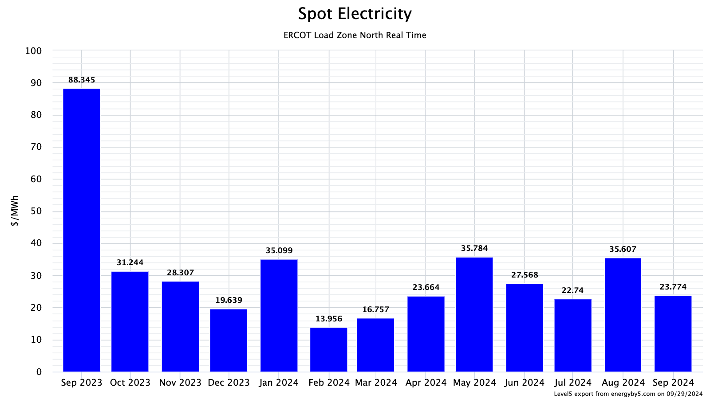
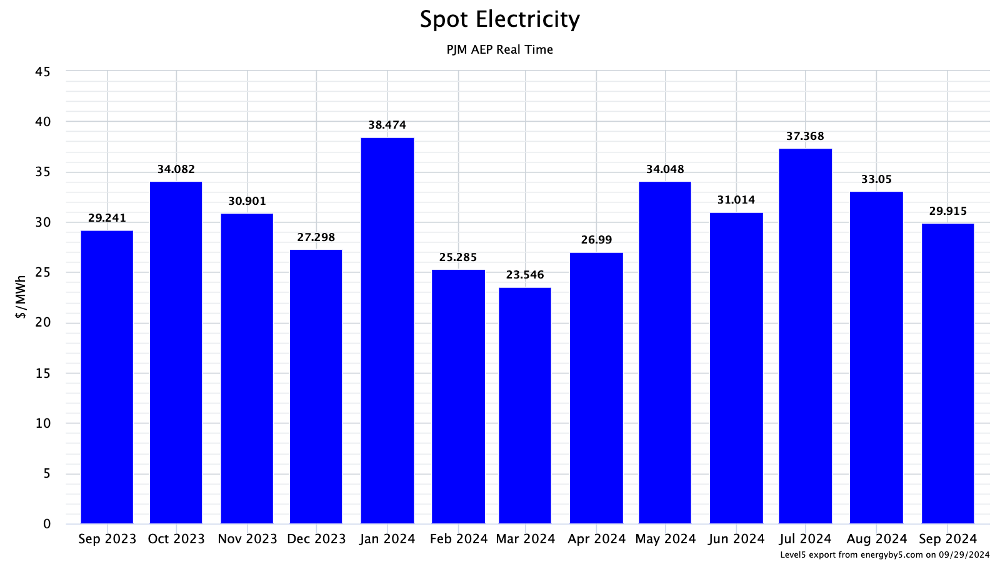
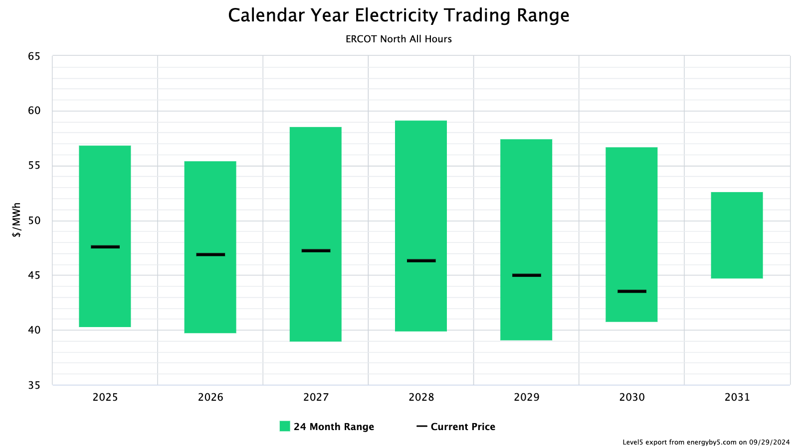
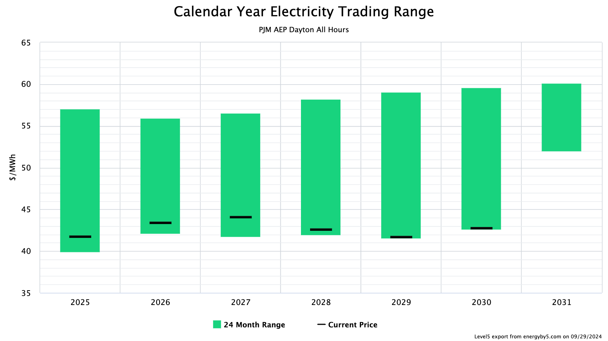
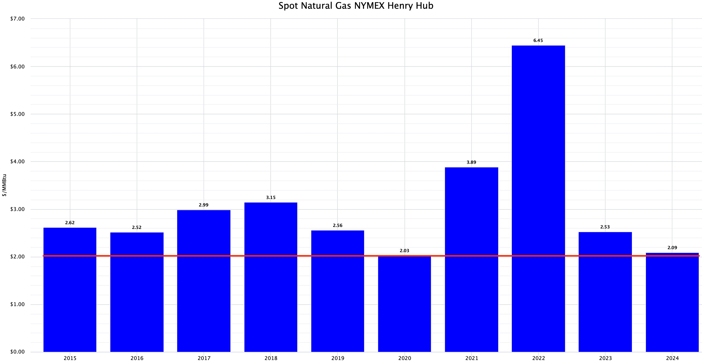
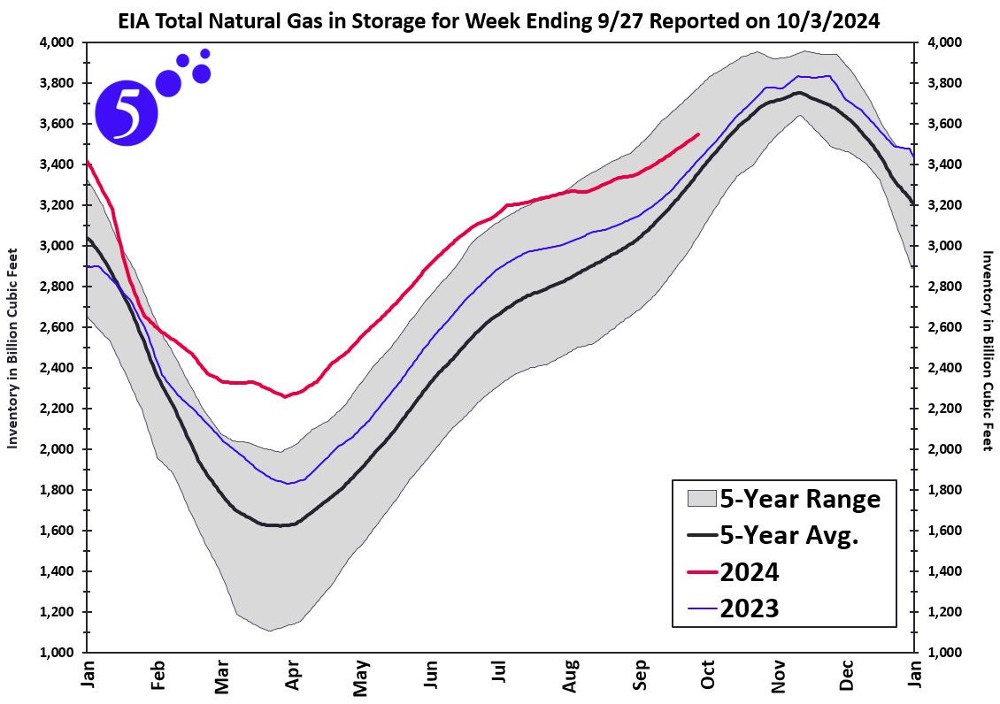

# ENERGY MARKET & DIGITAL ASSET BRIEF
[Zac Coventry](https://www.linkedin.com/in/zaccoventry/) & [5's Z-Team](https://www.energyby5.com/people/eric-bratcher) and [Level5](https://www.energyby5.com/level5)  
October 18, 2024  

| SECTION | CONTENT |  
| - | - |  
| [**HEADLINE**](#decentralized-finance-and-our-evolving-financial-options) | [Decentralized finance and our evolving financial options](#decentralized-finance-and-our-evolving-financial-options) |    
| [**MARKETS**](#energy-markets) | [Power](#power-markets)   [Natural Gas](#natural-gas-markets) |    
| [**WEATHER**](#weather)  |   |      

 

## DECENTRALIZED FINANCE AND OUR EVOLVING FINANCIAL OPTIONS
One of life's ironies is the changes that matter most are often easy to miss. 
> _Our children are born and we are the center of our their world. We blink and they are striding toward adulthood._
>
> _We make healthy lifestyle decisions until they become habits. Before we realize it, those habits reshape our identity._
> 
> _We hone our professional skills for days and weeks and years. In time, those skills carve out a unique niche that becomes a career._
 

The same may be true for recent, incremental changes in global financial markets, systems, and services. **Is it possible that blockchain technology, decentralized finance, and computational power are reshaping our financial reality and, yet, those changes go largely unnoticed in the midst of our busy lives?** 

I believe that it is. 

As a US$40 billion case-in-point, consider consider _Block, Inc._ ([NYSE: SQ](https://www.google.com/finance/quote/SQ:NYSE?sa=X&ved=2ahUKEwikkKC2qPCIAxW9GtAFHcMxOZsQ3ecFegQINRAZ)). Formerly known as _Square_, Block is a publically traded financial technology company with a market capitalization approaching US$40 billion, 2023 revenues of almost US$22 billion, and 12,000 employees spread across multiple business lines including [Square](https://squareup.com/us/en); [Cash App](https://cash.app/); [tbd](https://tbd.website/), and [Spiral](https://spiral.xyz/). Chances are you've used their services to pay for coffee, street food, or a haircut. 

> _Bitcoin is the best money. It whould be used like it. We build and fund free, open-source projects aimed at making bitcoin the planet's preferred currency_ [(Spiral)](https://spiral.xyz/).  
>
> _TBD is focused on building open and decentralized technologies to create a truly open financial world. Guided by this vision, TBD is creating an open source developer platform and infrastructure that enables everyone to access and participate in the global economy_ [(tbd)](https://tbd.website/).  

**Block and financial innovators like them are investing heavily in the culture and technology around decentralized finance. We may not feel the gravity of these changes in the moment, but the long-term implications of their investments are vast.** 
  

## ENERGY MARKETS  
**From most perspectives, U.S. energy market prices are a bargain right now though beginning to show bullish sentiments.** I do not expect these buying opportunities to persist in the medium term. 

### POWER MARKETS  
ERCOT and PJM wholesale power prices are clearing around $25/MWh (Figure 1) and $30/MWh (Figure 2), respectively. When evaluated agains prices ranges over the last twenty-four months, these prices fall in the bottom half of the range for ERCOT (Figure 3) and PJM (Figure 4).  

    

**Figure 1**. _ERCOT North monthly average spot prices, September 2023 - September 2024_  
   

     

**Figure 2**. _PJM AEP Dayton monthly average spot prices, September 2023 - September 2024_  
   

     

**Figure 3**. _ERCOT North annual futures over a 24-month range_  
   

    

**Figure 4**. _PJM AEP Dayton annual futures over a 24-month range_  
   
 

### NATURAL GAS MARKETS  
Annualized natural gas prices remain at near-historic lows (Figure 5). These low prices will be challenged by multiple bullish forces such as increasing LNG exports and U.S. storage values creeping closer to the five-year historical average (Figure 6).

   

**Figure 5**. _Annualized wholesale natural gas, NYMEX Henry Hub, 2015-2024_  
   

    

**Figure 6**.
   

### WEATHER 
For ERCOT, near-term temparature outlooks (Figures 7 and 8) are slightly bullish since above average fall temperatures prolong cooling loads and reduce the amount of natural gas available for storage. For PJM, these same outlooks are mostly neutral since temperatures are not yet low enough to generate significant heating loads.

NOAA is predicting above average fall and early-winter temperatures which should be bearish for in both ERCOT and PJM (Figure 9). From a supply/demand balance perspective, a major cold weather event in the early fall could cause a price spike due to the tightness of the supply/demand balance in U.S.markets.

**Figure 7**. Source: [NOAA, 2024](https://www.cpc.ncep.noaa.gov/products/predictions/610day/610temp.new.gif)   
     

   

**Figure 8**. Source: [NOAA, 2024](https://www.cpc.ncep.noaa.gov/products/predictions/814day/index.php)   
     

  

**Figure 9**. Source: [NOAA, 2024](https://www.cpc.ncep.noaa.gov/products/predictions/long_range/seasonal.php?lead=2)     
    

Long-Term Bullish,  

**Zac Coventry**  
Senior Engineer & Energy Advisor  
956-335-8500 | [energyby5.com](https://www.energyby5.com/home)    
zac.coventry@energyby5.com  
[LinkedIn](https://www.linkedin.com/in/zaccoventry/)    

